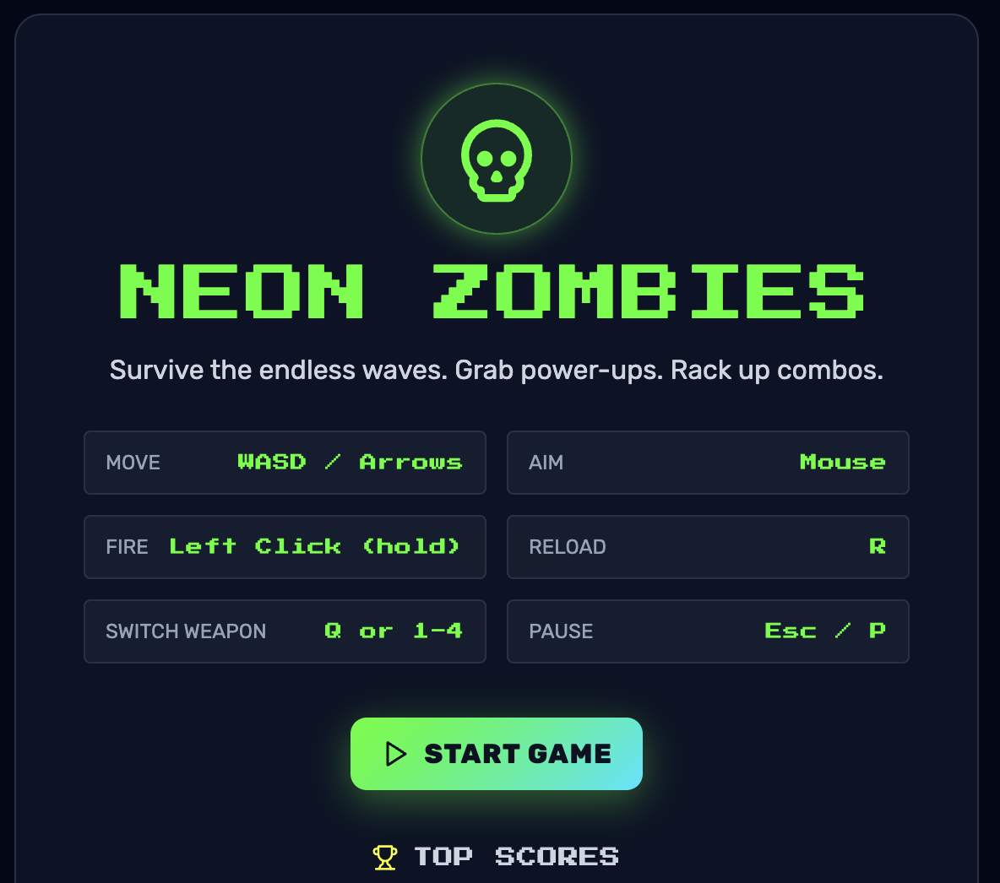
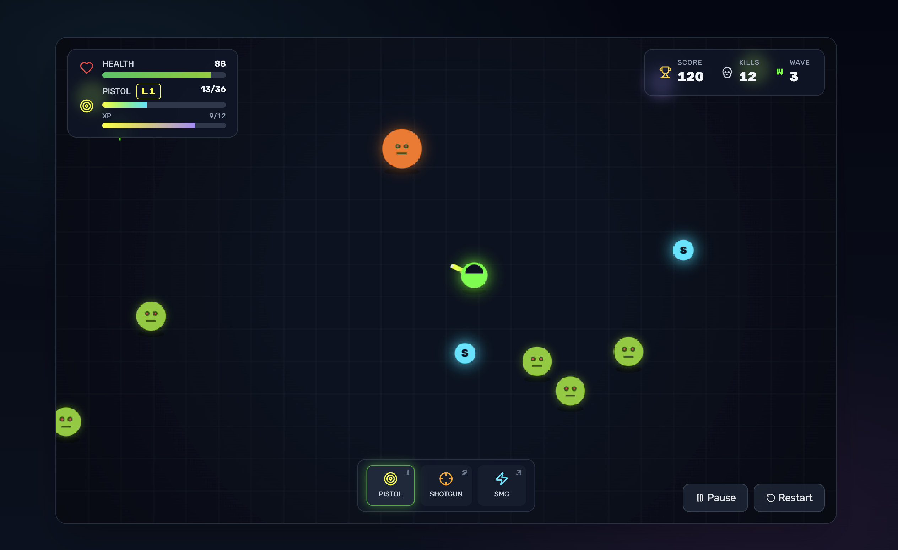

# 🧟 Zombie Shooter

A canvas-rendered, 2D top-down zombie shooter built with Vite + React 18 + Tailwind — where every frame is hand-crafted on a `<canvas>`, and all game logic runs outside React state.


_The starting screen — pick up the weapon, survive the horde._


_Survive waves of zombies. Collect dropped weapons. Level up your arsenal._

---

## How to play

```bash
npm install        # Install dependencies
npm run dev        # Start the dev server with hot reload
```

Then open your browser at `http://localhost:5173`.

```bash
npm test           # Run the test suite (Vitest)
npm run build      # Production build
npm run preview    # Preview the production build locally
```

### Controls

| Action          | Input             |
| --------------- | ----------------- |
| Move            | WASD / Arrow keys |
| Aim & Shoot     | Mouse click       |
| Switch weapon   | Digit keys 1–4    |
| Special ability | Q                 |
| Pause           | Escape            |

---

## Architecture at a glance

This project is a **canvas-first** game engine wrapped in a minimal React shell:

- **`src/game/useGameEngine.js`** — the entire game loop. A single `requestAnimationFrame` cycle drives `update(dt)` for game logic and `draw()` for rendering. All world state (player, bullets, zombies, power-ups, particles) lives in a mutable ref and is mutated in-place each frame.
- **`src/game/constants.js`** — data-driven config. Weapons, stats, pool sizes — all tweakable without touching logic.
- **Sprint 1 performance model** — object pools with `active` flags and deferred removal. No `splice` during iteration, no per-frame allocations. The goal: flat heap, ≤8 ms average frame time, zero freezes on cluster kills.

React is thin: it mounts the canvas and renders HUD overlays. Nothing game-critical flows through React state.

---

## Game Features

| Feature               | Sprint | Description                                               |
| --------------------- | ------ | --------------------------------------------------------- |
| 🌊 Wave System        | S2     | Escalating enemy waves that grow harder over time         |
| 💀 Enemy Variants     | S3     | Multiple zombie types with unique stats and behaviors     |
| 🔫 Weapon Drops       | S4     | Zombies drop weapons — pick them up to stay alive         |
| 🏆 Local Scoreboard   | S6     | Persistent high scores with name entry via `localStorage` |
| ⭐ Weapon Progression | S7     | Per-weapon XP and leveling — invest in the right gun      |
| ⚡ Performance        | S1     | Object pooling, zero GC spikes, flat memory profile       |

---

## How this game was built: AI-driven development

This project is developed entirely with **AI as a co-pilot** — using Large Language Models to plan, implement, test, and ship features autonomously.

### The pipeline

A chain of specialized AI agents works through the product backlog end-to-end:

1. **Product** prioritizes stories in a living backlog
2. **Developer** writes implementation files under feature branches
3. **QA** writes failing-then-passing tests (TDD, always)
4. **Archivist** moves shipped stories into the `done/` archive

This creates a linear pipeline: _plan → implement → test → ship → archive_ — with no hand-offs needed. Each story is small, focused, and independently testable. Failures halt the pipeline automatically so nothing regressions slips through.

### Why AI-driven?

- **Speed**: Features move from backlog to merged in minutes, not weeks
- **Consistency**: Every story follows the same pattern — tests first, clean code, archived cleanly
- **Traceability**: Every shipped feature has a story file, passing tests, and changelog entry
- **Quality guardrails**: The pipeline stops on failure. No silent skips, no skipped tests

The result is a game that ships features in sprints, maintains test coverage, and keeps its codebase clean — all driven by AI agents working through a structured pipeline.

---

## Project structure

```
├── assets/              # Game screenshots and art
├── src/
│   ├── game/
│   │   ├── constants.js    # All data-driven config
│   │   ├── useGameEngine.js # Game loop + engine logic
│   │   └── __tests__/       # Vitest test suite
│   └── App.jsx              # React entry (canvas mount + HUD)
├── userstories/
│   ├── BACKLOG.md           # Prioritized sprint backlog
│   ├── sprint-1-performance/  # Active story files
│   └── done/                # Archived shipped stories
└── CLAUDE.md                # Dev guidance for the AI team
```

---

## License

Private project. All rights reserved.
